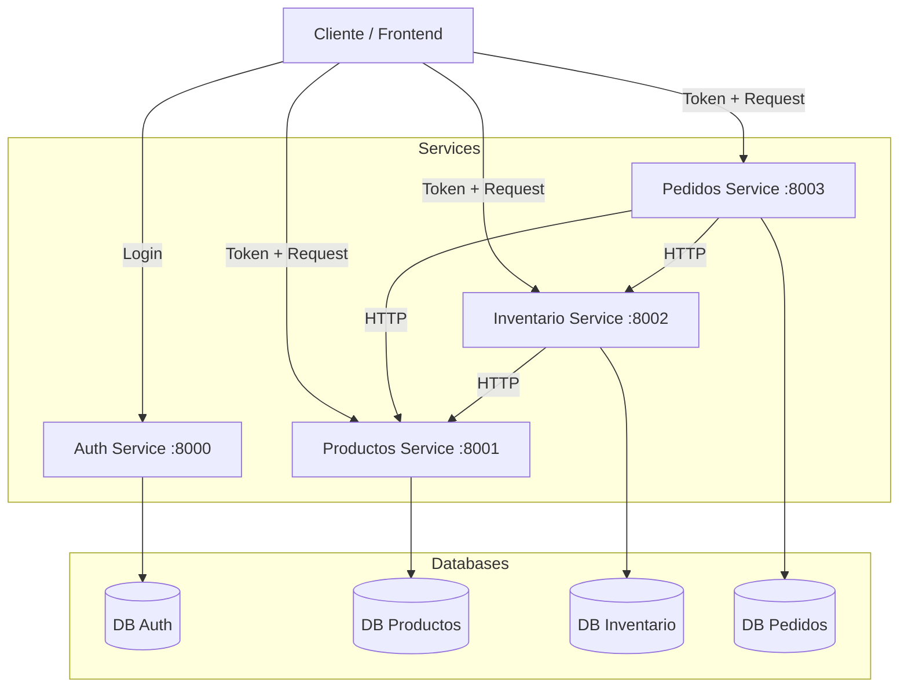

# Arquitectura del Sistema

## Visión General

El sistema sigue una arquitectura de microservicios donde cada dominio de negocio está encapsulado en su propio servicio desplegable de forma independiente. Esta arquitectura permite escalar componentes específicos según la demanda y mantiene una separación clara de responsabilidades.

## Diagrama de Comunicación



## Componentes del Sistema

### 1. Servicio de Autenticación (`auth`)
**Responsabilidad**: Gestión de identidades y acceso.
- Valida credenciales de usuario.
- Genera tokens JWT (JSON Web Tokens) firmados.
- Contiene la lógica de hashing de contraseñas.

### 2. Servicio de Productos (`productos`)
**Responsabilidad**: Catálogo maestro de productos.
- Mantiene la información descriptiva de los productos (nombre, descripción, precio).
- Permite operaciones CRUD sobre el catálogo.

### 3. Servicio de Inventario (`inventario`)
**Responsabilidad**: Control de existencias físicas.
- Mantiene el conteo actual de stock por producto.
- Maneja la reserva y decremento de stock al realizarse un pedido.
- Expone endpoints para verificar disponibilidad.
- **Comunicación**: Consulta al servicio de Productos para validar la existencia de un producto al momento de crear su inventario.

### 4. Servicio de Pedidos (`pedidos`)
**Responsabilidad**: Orquestación de compras.
- Recibe la intención de compra del usuario.
- Interactúa con otros servicios (Inventario, Productos) para validar la orden.
- Registra la transacción y su estado (Pendiente, Completado, Cancelado).

## Patrones de Diseño Utilizados

- **API Gateway (Implícito)**: Actualmente expuesto directamente o vía proxy inverso.
- **Database per Service**: Cada microservicio administra su propio esquema de base de datos para garantizar el desacoplamiento.
- **Circuit Breaker**: Implementado para manejar fallos en la comunicación entre servicios (evitando fallos en cascada).
- **Asynchronous Communication**: Uso de `asyncio` y `httpx` para llamadas no bloqueantes.

## Estrategia de Resiliencia

El sistema implementa múltiples capas de protección para garantizar la disponibilidad:

### Circuit Breaker (aiobreaker)

Previene fallos en cascada cuando un servicio no está disponible.

```
Estado CERRADO → Llamadas normales
     │
     └─ 5 fallos → Estado ABIERTO (rechaza llamadas por 60s)
                        │
                        └─ 60s → Estado HALF-OPEN (prueba una llamada)
                                      │
                                      ├─ Éxito → CERRADO
                                      └─ Fallo → ABIERTO
```

**Configuración:**
- `fail_max=5`: Se abre después de 5 fallos consecutivos
- `timeout_duration=60s`: Permanece abierto por 60 segundos
- `exclude=[HTTPException]`: Solo cuenta errores de conexión, no errores de negocio (404, 400)

### Retry Policy (Tenacity)

Reintenta automáticamente las llamadas fallidas antes de contar como fallo:

- **3 reintentos** por cada llamada
- **2 segundos** de espera entre reintentos
- Solo reintenta errores de conexión (`httpx.RequestError`)

### Flujo de Resiliencia

```
1. Petición HTTP
   │
2. ¿Circuito abierto?
   ├── Sí → Error 503 inmediato
   └── No → Continúa
       │
3. Tenacity intenta la llamada
   ├── Éxito → Respuesta normal
   └── Fallo de conexión
       └── Reintenta hasta 3 veces
           │
4. ¿Sigue fallando?
   ├── No → Respuesta normal
   └── Sí → Cuenta como fallo para el breaker
       │
5. ¿5 fallos acumulados?
   ├── No → Error 503 (servicio no disponible)
   └── Sí → Abre el circuito por 60 segundos
```

### Errores que abren el circuito

| Tipo de Error | ¿Abre el Circuito? |
|---------------|-------------------|
| Servicio apagado | ✅ Sí |
| Timeout | ✅ Sí |
| Problemas de red | ✅ Sí |
| 404 Not Found | ❌ No (error de negocio) |
| 400 Bad Request | ❌ No (error de negocio) |
| 500 Server Error | ❌ No (excluido) |

