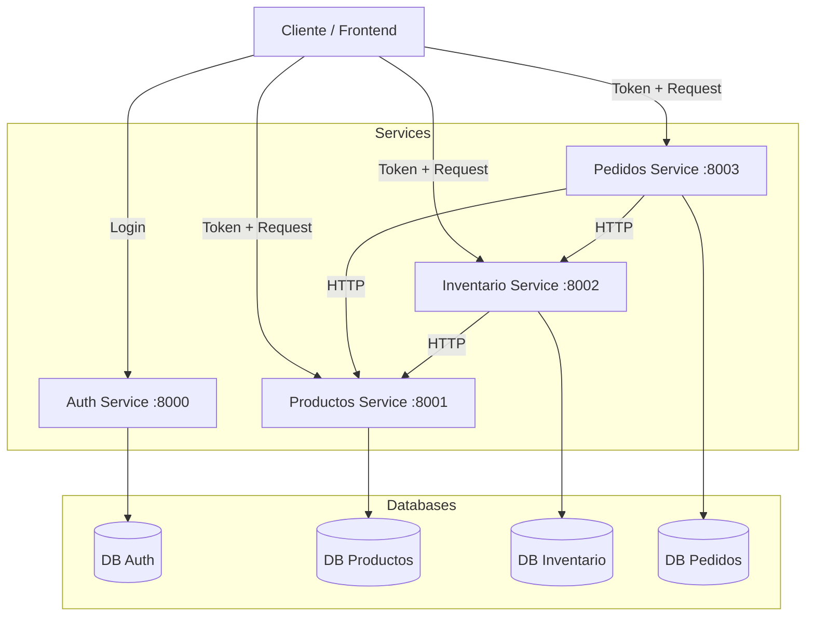

# Arquitectura del Sistema

## Visión General

El sistema sigue una arquitectura de microservicios donde cada dominio de negocio está encapsulado en su propio servicio desplegable de forma independiente. Esta arquitectura permite escalar componentes específicos según la demanda y mantiene una separación clara de responsabilidades.

## Diagrama de Comunicación

## Componentes del Sistema

### 1. Servicio de Autenticación (`auth`)
**Responsabilidad**: Gestión de identidades y acceso.
- Valida credenciales de usuario.
- Genera tokens JWT (JSON Web Tokens) firmados.
- Contiene la lógica de hashing de contraseñas.

### 2. Servicio de Productos (`productos`)
**Responsabilidad**: Catálogo maestro de productos.
- Mantiene la información descriptiva de los productos (nombre, descripción, precio).
- Permite operaciones CRUD sobre el catálogo.

### 3. Servicio de Inventario (`inventario`)
**Responsabilidad**: Control de existencias físicas.
- Mantiene el conteo actual de stock por producto.
- Maneja la reserva y decremento de stock al realizarse un pedido.
- Expone endpoints para verificar disponibilidad.
- **Comunicación**: Consulta al servicio de Productos para validar la existencia de un producto al momento de crear su inventario.

### 4. Servicio de Pedidos (`pedidos`)
**Responsabilidad**: Orquestación de compras.
- Recibe la intención de compra del usuario.
- Interactúa con otros servicios (Inventario, Productos) para validar la orden.
- Registra la transacción y su estado (Pendiente, Completado, Cancelado).

## Patrones de Diseño Utilizados

- **API Gateway (Implícito)**: Actualmente expuesto directamente o vía proxy inverso.
- **Database per Service**: Cada microservicio administra su propio esquema de base de datos para garantizar el desacoplamiento.
- **Circuit Breaker**: Implementado para manejar fallos en la comunicación entre servicios (evitando fallos en cascada).
- **Asynchronous Communication**: Uso de `asyncio` y `httpx` para llamadas no bloqueantes.
